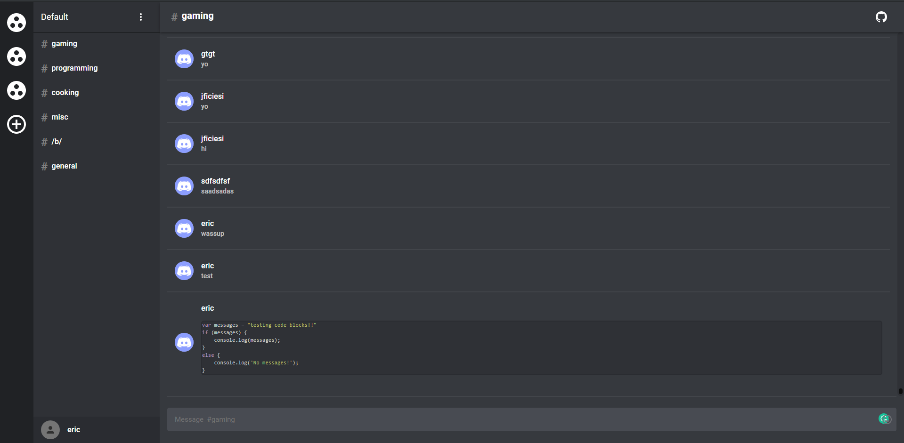

## React Discord Clone

Originally started off on a test project for learning Functional Components, Hooks and Socket IO. I then decided to create a Discord Clone

Demo (Work in progress) http://ericellb.github.io/React-Discord-Clone



## Features
  Implemented Features
  - [x] Real time messaging in channels using Socket IO
  - [x] Local authentication
  - [x] Loading of Servers / Channels / history based on per user basis
  - [x] Creation of Servers
  - [x] Joining of Servers
  - [x] Creation of Channels in a Server
  - [x] Broadcasting messages to Specific Channels
  - [x] Server Settings (Change name)
  - [x] Persistent channel history
  - [x] Channel Settings (Change name and delete)
  - [x] Pretty Prints Code encloded in ``` 

  Todo
  - [ ] Private messaging